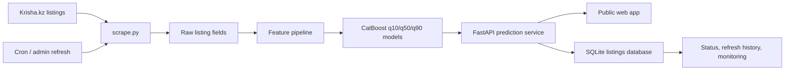

# Astana Real Estate ML

[](https://github.com/kairosh1001/astana-real-estate-ml/actions/workflows/ci.yml)

End-to-end ML web app for finding potentially undervalued apartment listings in Astana, Kazakhstan.

Live demo: [kvartiry-ai.kz](https://kvartiry-ai.kz)

## Overview

This project collects apartment listings from Krisha.kz, transforms raw listing pages into model-ready features, estimates market price per square meter with CatBoost quantile regression, and serves a public web interface for ranking listings that appear to be priced below the model's conservative estimate.

The goal is not to replace human due diligence. The app is an analytical screening tool: it helps users narrow a large real estate market into a smaller list of listings worth checking manually.

## What It Does

- Scrapes apartment listings for Astana from Krisha.kz.
- Cleans and normalizes listing attributes such as price, area, rooms, district, floor, construction year, and residential complex.
- Builds geospatial features, including H3 cells and distances to selected city landmarks.
- Trains three CatBoost quantile models: q10, q50, and q90.
- Ranks active listings by conservative upside: q10 model estimate vs asking price.
- Serves a FastAPI web app with filters, map-based polygon search, listing comparison, saved/hidden listings, price history, and model explanations.
- Runs scheduled refresh jobs on a VPS using Docker Compose and cron.
- Provides admin pages for refresh history, service status, model monitoring snapshots, and model version checks.

## Tech Stack

| Layer | Tools |
| --- | --- |
| Data collection | Python, Requests, BeautifulSoup |
| Data processing | Pandas, NumPy, H3 |
| ML | CatBoost quantile regression |
| Backend | FastAPI, Jinja2 |
| Storage | SQLite |
| Frontend | Server-rendered HTML/CSS/JS, Leaflet |
| Deployment | Docker, Docker Compose, Caddy, Linux VPS |
| Operations | Cron, admin refresh UI, monitoring snapshots |

## Architecture



## Model

The model predicts apartment price per square meter on a log scale. Instead of training only one point estimate, the project trains three quantile models:

- `q10`: lower estimate, used for conservative below-market ranking.
- `q50`: median estimate, used as the central model estimate.
- `q90`: upper estimate, used to show uncertainty range.

Main feature groups:

- apartment parameters: area, rooms, floor, total floors, construction year, ceiling height;
- categorical fields: district, residential complex, building type, condition, furnishing;
- geospatial fields: H3 indexes and distances to selected Astana landmarks;
- engineered fields: floor ratio and normalized listing attributes.

The current feature contract is stored in [`model_metadata.json`](model_metadata.json).

## User-Facing Features

- Ranking of active below-market listings.
- District, room count, price, construction year, residential complex, area, recency, and minimum-upside filters.
- Multi-district filtering.
- Map polygon search with Leaflet.
- Listing details page with q10/q50/q90 estimates and price history.
- Comparison page for multiple listings.
- Browser-local saved and hidden listings.
- Public explanation pages for non-technical users.

## Admin Features

- Admin login using `ADMIN_TOKEN`.
- Manual refresh page for controlled scraping runs.
- Refresh history with status, pages, URL count, processed listings, and failures.
- Service status page with database counts.
- Model monitoring page with data-quality and drift-proxy snapshots.
- Model version page showing loaded model files, timestamps, target, and feature counts.
- Retraining scaffold in [`scripts/retrain_models.py`](scripts/retrain_models.py).

## Repository Structure

```text
app/                 FastAPI app, templates, services, database layer
models/              Trained CatBoost model files
scripts/             Validation, refresh, backup, and retraining scripts
deploy/              VPS, Caddy, cron, and deployment notes
dataset.ipynb        Notebook used for data cleaning, feature engineering, and model work
df_check.csv         Model-ready dataset snapshot used for validation and retraining
model_metadata.json  Feature contract used by training and serving
```

See [`DATA.md`](DATA.md) for notes about data files and reproducibility.

## Local Setup

Create a Python 3.11 virtual environment and install dependencies:

```powershell
python -m venv .venv
.\.venv\Scripts\python.exe -m pip install -r requirements.txt
```

Run validation checks:

```powershell
.\.venv\Scripts\python.exe scripts\check_deployment.py
.\.venv\Scripts\python.exe scripts\check_ui.py
.\.venv\Scripts\python.exe scripts\validate_feature_pipeline.py
.\.venv\Scripts\python.exe scripts\validate_models.py --rows 200000
```

Run the app locally:

```powershell
$env:ADMIN_TOKEN="change-me"
.\.venv\Scripts\python.exe -m uvicorn app.main:app --host 127.0.0.1 --port 8000
```

Open:

```text
http://127.0.0.1:8000
```

## Docker

Docker Desktop must be running before using Docker commands.

```bash
docker compose build
docker compose up -d app
```

Run checks inside Docker:

```bash
docker compose exec -T app python scripts/check_deployment.py
docker compose exec -T app python scripts/check_ui.py
```

## Refreshing Listings

Small smoke test:

```powershell
.\.venv\Scripts\python.exe scripts\refresh_listings.py --pages 1 --max-listings 3 --min-delay 0 --max-delay 0
```

Typical scheduled refreshes:

```powershell
.\.venv\Scripts\python.exe scripts\refresh_listings.py --kind daily --pages 50
.\.venv\Scripts\python.exe scripts\refresh_listings.py --kind weekly --pages 200
```

The deployed VPS uses cron and Docker Compose; see [`deploy/README.md`](deploy/README.md).

## Telegram Bot

The Telegram bot runs as a separate Docker Compose profile and shares the same
SQLite database and CatBoost models as the website.

Create a bot with Telegram `@BotFather`, then set these values in `.env`:

```text
TELEGRAM_BOT_TOKEN=123456:bot-token-from-botfather
TELEGRAM_BOT_USERNAME=your_bot_username
APP_PUBLIC_URL=https://kvartiry-ai.kz
TELEGRAM_DIGEST_HOUR_ASTANA=9
```

Start it on the VPS:

```bash
docker compose --profile https --profile bot up -d --build
```

The bot supports:

- Krisha listing link evaluation;
- `/on` to enable daily "Новые выгодные за 24 часа";
- `/off` to disable daily notifications;
- `/help` for a short command list.

## Retraining

The retraining script trains candidate q10/q50/q90 CatBoost models into a timestamped directory under `models_candidate/`:

```powershell
.\.venv\Scripts\python.exe scripts\retrain_models.py
```

The script writes:

- candidate `.cbm` model files;
- copied `model_metadata.json`;
- `evaluation_report.md` with validation metrics.

Candidate models should be reviewed before replacing the production files in `models/`.

## Disclaimer

This is a portfolio and educational project. The app uses publicly available listing information and model-based estimates. It does not verify legal status, property condition, seller behavior, or final transaction price. Any real estate decision should include manual due diligence.
