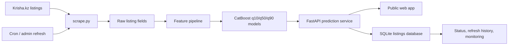

# Kvartiry AI — Kazakhstan Real Estate ML

[](https://github.com/kairosh1001/astana-real-estate-ml/actions/workflows/ci.yml)

End-to-end ML web app for finding and analyzing apartment listings in Astana and Almaty, Kazakhstan.

Live demo: [kvartiry-ai.kz](https://kvartiry-ai.kz)

## Overview

This project collects apartment listings from Krisha.kz, transforms raw listing pages into model-ready features, estimates market price per square meter with city-routed CatBoost quantile regression, and serves a public web interface for ranking listings that appear to be priced below the model's conservative estimate.

The goal is not to replace human due diligence. The app is an analytical screening tool: it helps users narrow a large real estate market into a smaller list of listings worth checking manually.

## What It Does

- Scrapes apartment sale and long-term rental listings for Astana and Almaty from Krisha.kz.
- Cleans and normalizes listing attributes such as price, area, rooms, district, floor, construction year, and residential complex.
- Builds geospatial features, including H3 cells and distances to selected city landmarks.
- Trains three CatBoost quantile models: q10, q50, and q90.
- Ranks active listings by conservative upside: q10 model estimate vs asking price.
- Serves a FastAPI web app with filters, personal home matching, map-based polygon search, listing comparison, account-synced watchlists, price history, and model explanations.
- Runs scheduled refresh jobs on a VPS using Docker Compose and cron.
- Estimates long-term monthly rent, gross rental yield, and simple payback with a
  separate CatBoost quantile model trained on Astana and Almaty rental listings.
- Provides admin pages for refresh history, service status, model monitoring snapshots, and model version checks.

## Tech Stack

| Layer | Tools |
| --- | --- |
| Data collection | Python, Requests, BeautifulSoup |
| Data processing | Pandas, NumPy, H3 |
| ML | CatBoost quantile regression |
| Backend | FastAPI, Jinja2 |
| Storage | SQLite |
| Frontend | Server-rendered HTML/CSS/JS, Leaflet |
| Deployment | Docker, Docker Compose, Caddy, Linux VPS |
| Operations | Cron, admin refresh UI, monitoring snapshots |

## Architecture


```mermaid
flowchart LR
    A["Krisha.kz listings"] --> B["scrape.py"]
    B --> C["Raw listing fields"]
    C --> D["Feature pipeline"]
    D --> E["CatBoost q10/q50/q90 models"]
    E --> F["FastAPI prediction service"]
    F --> G["Public web app"]
    F --> H["SQLite listings database"]
    I["Cron / admin refresh"] --> B
    H --> J["Status, refresh history, monitoring"]
```

## Model

The service predicts apartment price per square meter on a log scale and uses a
city-aware model router:

- Astana uses its validated 41-feature Astana v2 model;
- Almaty uses the 41-feature Almaty v2 model;
- city bundles load lazily on their first request, while the universal bundle
  remains available as a controlled fallback.

Both bundles expose `q10`, a central point estimate, and `q90`. The interval
models are calibrated in log space and serving guarantees ordered outputs.

Main feature groups:

- apartment parameters: area, rooms, floor, total floors, construction year, ceiling height;
- categorical fields: district, residential complex, building type, condition, furnishing;
- geospatial fields: H3 indexes and reusable OSM proximity/density features;
- engineered fields: floor position, area per room, building age, and normalized
  listing attributes.

The current feature contract is stored in [`model_metadata.json`](model_metadata.json).

## User-Facing Features

- Ranking of active below-market listings.
- Personal apartment ranking for living in Astana, with hard filters, weighted priorities, explainable match scores, and local OpenStreetMap proximity features.
- District, room count, price, construction year, residential complex, apartment condition, new-build, area, recency, and minimum-upside filters.
- Multi-district filtering.
- Map polygon search with Leaflet.
- Listing details page with q10/q50/q90 estimates and price history.
- Apartment valuation either from a Krisha link or manually entered model inputs.
- Comparison page for multiple listings.
- Registration, secure login, account-synced saved listings, price-change tracking, and personal notes. Guest saves migrate into the account after login; hidden listings remain browser-local.
- Explainable same-city active-listing comparables with visible similarity reasons; these are asking-price references, not completed sales.
- Public explanation pages for non-technical users.

## Admin Features

- Admin login using `ADMIN_TOKEN`.
- Manual refresh page for controlled scraping runs.
- Refresh history with status, pages, URL count, processed listings, and failures.
- Service status page with database counts.
- Model monitoring page with data-quality and drift-proxy snapshots.
- Model version page showing loaded model files, timestamps, target, and feature counts.
- Retraining scaffold in [`scripts/retrain_models.py`](scripts/retrain_models.py).

## Repository Structure

```text
app/                 FastAPI app, templates, services, database layer
models/              Trained CatBoost model files
scripts/             Validation, refresh, backup, and retraining scripts
deploy/              VPS, Caddy, cron, and deployment notes
dataset.ipynb        Notebook used for data cleaning, feature engineering, and model work
df_check.csv         Model-ready dataset snapshot used for validation and retraining
model_metadata.json  Astana v1 feature contract
models/universal_v2  Universal v2 models, metadata, calibration, and config
models/astana_v2     Astana v2 models, metadata, calibration, and config
models/almaty_v2     Almaty v2 models, metadata, calibration, and config
```

See [`DATA.md`](DATA.md) for notes about data files and reproducibility.

## Local Setup

Create a Python 3.11 virtual environment and install dependencies:

```powershell
python -m venv .venv
.\.venv\Scripts\python.exe -m pip install -r requirements.txt
```

Run validation checks:

```powershell
.\.venv\Scripts\python.exe -m unittest discover -s tests -v
.\.venv\Scripts\python.exe scripts\check_deployment.py
.\.venv\Scripts\python.exe scripts\check_ui.py
.\.venv\Scripts\python.exe scripts\validate_feature_pipeline.py
.\.venv\Scripts\python.exe scripts\validate_models.py --rows 200000
.\.venv\Scripts\python.exe scripts\validate_model_routing.py
```

Run the app locally:

```powershell
$env:ADMIN_TOKEN="change-me"
.\.venv\Scripts\python.exe -m uvicorn app.main:app --host 127.0.0.1 --port 8000
```

Open:

```text
http://127.0.0.1:8000
```

## Docker

Docker Desktop must be running before using Docker commands.

```bash
docker compose build
docker compose up -d app
```

Run checks inside Docker:

```bash
docker compose exec -T app python scripts/check_deployment.py
docker compose exec -T app python scripts/check_ui.py
docker compose exec -T app python scripts/validate_model_routing.py
```

## Refreshing Listings

Small smoke test:

```powershell
.\.venv\Scripts\python.exe scripts\refresh_listings.py --pages 1 --max-listings 3 --min-delay 0 --max-delay 0
```

Typical scheduled refreshes:

```powershell
.\.venv\Scripts\python.exe scripts\refresh_listings.py --city astana --kind daily --pages 100
.\.venv\Scripts\python.exe scripts\refresh_listings.py --city almaty --kind daily --pages 100
.\.venv\Scripts\python.exe scripts\refresh_listings.py --city astana --kind weekly --pages 200
.\.venv\Scripts\python.exe scripts\refresh_listings.py --city almaty --kind weekly --pages 200
```

The production refresh retries temporarily empty Krisha result pages with a fresh
session and only stops after three consecutive pages remain empty. This prevents a
single blocked or incomplete response from truncating a 100-page city refresh.

Telegram subscribers can choose the daily digest market with the bot buttons or
commands `/astana` and `/almaty`. Existing subscribers keep Astana as
their default until they choose another option.

The personal home finder uses a compact local OpenStreetMap POI snapshot. Refresh it manually when city infrastructure changes:

```powershell
.\.venv\Scripts\python.exe scripts\refresh_poi_catalog.py
```

The generated `app/data/kazakhstan_pois.json` file contains separate Astana and
Almaty POIs and is deployed with the app, so page views do not call an external
maps API.

The deployed VPS uses cron and Docker Compose; see [`deploy/README.md`](deploy/README.md).

## Telegram Bot

The Telegram bot runs as a separate Docker Compose profile and shares the same
SQLite database and CatBoost models as the website.

Create a bot with Telegram `@BotFather`, then set these values in `.env`:

```text
TELEGRAM_BOT_TOKEN=123456:bot-token-from-botfather
TELEGRAM_BOT_USERNAME=your_bot_username
APP_PUBLIC_URL=https://kvartiry-ai.kz
TELEGRAM_DIGEST_HOUR_ASTANA=9
TELEGRAM_ADMIN_PASSWORD=use-a-separate-long-random-password
TELEGRAM_ADMIN_REPORT_HOUR_ASTANA=8
```

Start it on the VPS:

```bash
docker compose --profile https --profile bot up -d --build
```

The bot supports:

- Krisha listing link evaluation;
- `/on` to enable daily "Новые выгодные за 24 часа";
- `/off` to disable daily notifications;
- `/help` for a short command list.

Private admin reports are paired with `/admin YOUR_PASSWORD` in a direct chat.
The bot deletes that command on a best-effort basis and never stores the password.
The separate password must contain at least 16 characters.
After pairing, `/admin_status` sends the operational report immediately,
`/admin_off` and `/admin_on` control the daily report, and `/admin_logout`
revokes the chat. The report contains public-site health, 24-hour traffic and
errors, aggregate account counts, per-city listing totals, and refresh status;
it does not include names, email addresses, or other user details.

## Retraining

The retraining script trains candidate q10/q50/q90 CatBoost models into a timestamped directory under `models_candidate/`:

```powershell
.\.venv\Scripts\python.exe scripts\retrain_models.py
```

The script writes:

- candidate `.cbm` model files;
- copied `model_metadata.json`;
- `evaluation_report.md` with validation metrics.

Candidate models should be reviewed before replacing the production files in `models/`.

The validated universal v2 candidate can be promoted reproducibly with:

```powershell
.\.venv\Scripts\python.exe scripts\promote_v2_bundle.py --scope universal
.\.venv\Scripts\python.exe scripts\promote_v2_bundle.py --scope astana
.\.venv\Scripts\python.exe scripts\promote_v2_bundle.py --scope almaty
.\.venv\Scripts\python.exe scripts\validate_model_routing.py
```

`PRICE_MODEL_ROUTING=city_auto` is the production default. It routes Astana to
`astana_v2` and Almaty to `almaty_v2`, with `universal_v2` as the v2 fallback.
The explicit values `astana_v1`, `astana_v2`, `almaty_v2`, and `universal_v2`
are available for controlled QA only.

## Account Security and Data

The SQLite bootstrap creates the user, session, and saved-listing tables
idempotently. Passwords use Argon2id; browser session tokens are random and only
their SHA-256 digests are stored. All state-changing account/watchlist requests
require a per-session CSRF token. Production cookies become `Secure` whenever
HTTPS is detected through the request or `X-Forwarded-Proto`; `COOKIE_SECURE=true`
can enforce this explicitly.

Database backups now include account emails, saved URLs, and personal notes.
Store backup files with restricted access and a documented retention period.

## Disclaimer

This is a portfolio and educational project. The app uses publicly available listing information and model-based estimates. It does not verify legal status, property condition, seller behavior, or final transaction price. Any real estate decision should include manual due diligence.
